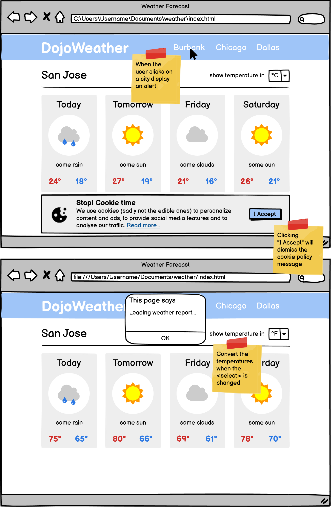
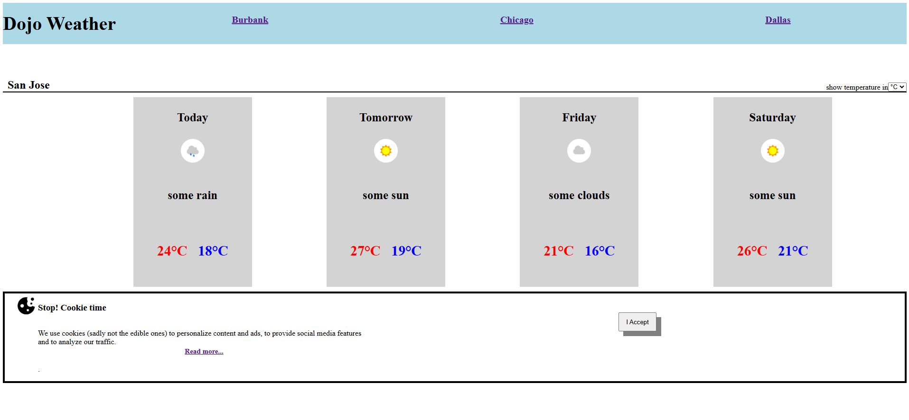
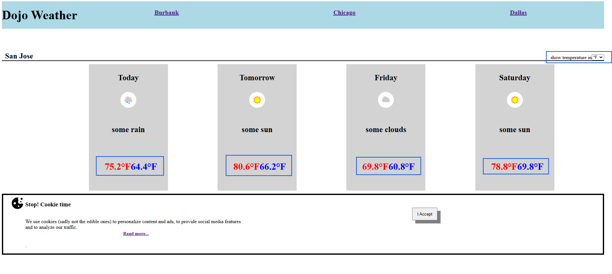
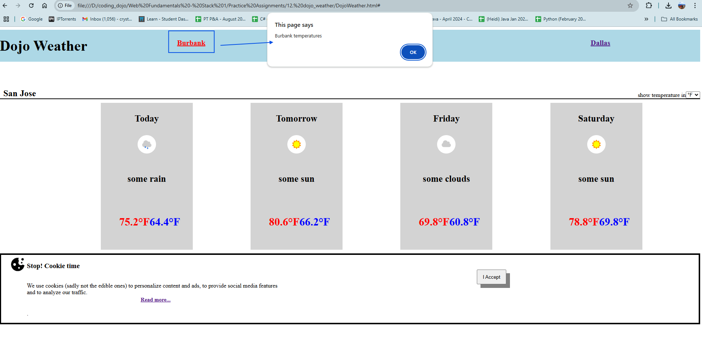

# Dojo Weather

#### Difficulty Level: Advanced | Est. Time: 4+ hours

Using `HTML`, `CSS`, and `JS` recreate the look and functionality of the following website. The Yellow Belt will have a similar set of feature requirements. The cropped images can be downloaded here.

- [x] Recreate the look of the Weather Forecast page using HTML and CSS

- [x] Use position: fixed; to position the cookie policy message at the bottom of the page

- [x] When a user clicks on a city, alert the message "Loading weather report..."

- [x] When the user accepts the cookie policy, hide the fixed message

- [x] Challenge: When the user changes the `<select> `convert the temperatures from Celsius to Fahrenheit.

Here is an example of mine below.

Show Temp in °F

Clicking the locations will create a notification.

